# RadioNoise

**True Random Number Generator using RTL-SDR radio noise**

[](https://www.python.org/downloads/)
[](LICENSE)
[](docs/nist-tests.md)

[Version française](README.fr.md)

RadioNoise generates cryptographic-quality passwords and passphrases from physical radio noise captured by an RTL-SDR USB dongle. The noise is processed through a multi-stage extraction and validation pipeline before use.

> **Scientific note**: The captured noise is predominantly thermal (Johnson-Nyquist), arising from classical statistical mechanics. It is computationally unpredictable but not fundamentally indeterministic like quantum phenomena. For cryptographic purposes, this distinction is irrelevant. See [Entropy Pipeline](docs/entropy-pipeline.md) for details.

## Features

- **Hardware entropy** from RTL-SDR radio noise, with automatic fallback to CPU RNG (RDRAND/RDSEED) or system CSPRNG
- **Von Neumann extraction** removes ADC bias, **SHA-512 whitening** ensures uniform distribution
- **15 NIST SP 800-22 tests** validate entropy quality before use (fast 9-test or full 15-test mode)
- **Passwords and passphrases** generated with rejection sampling (no modulo bias), using the EFF large wordlist (7776 words, ~12.9 bits/word)
- **Cryptographic traceability**: SHA-256 hash chain proofs, SQLite blockchain audit trail, AES-256-GCM encrypted backups
- **PyQt6 GUI** with dark theme, secure password display, clipboard auto-clear, and progressive tab workflow

## Pipeline

```mermaid
flowchart LR
    A["📡 RTL-SDR\nRadio Noise"] --> B["⚖️ Von Neumann\nBias Removal"]
    B --> C["🔒 SHA-512\nWhitening"]
    C --> D["📊 NIST\nValidation"]
    D --> E["🔑 Password\nGeneration"]

    style A fill:#2d5986,color:#fff
    style B fill:#8b5cf6,color:#fff
    style C fill:#059669,color:#fff
    style D fill:#d97706,color:#fff
    style E fill:#dc2626,color:#fff
```



## Quick Start

```bash
git clone https://github.com/Sherub1/RadioNoise.git
cd RadioNoise
pip install -r requirements.txt
python RadioNoise.py -n 5 -l 20
```

For detailed setup (RTL-SDR drivers, OS-specific instructions), see [INSTALL.md](INSTALL.md).

## Usage

### CLI

```bash
# Passwords (default: 5 passwords, 16 chars, safe charset)
python RadioNoise.py

# Custom length and count
python RadioNoise.py -n 10 -l 24 -c full

# Passphrases (6 words, ~77.5 bits entropy)
python RadioNoise.py -p -l 6

# Full NIST test suite (15 tests)
python RadioNoise.py --full-test -n 5

# Generate with cryptographic proof
python RadioNoise.py --proof -n 1 -l 24

# Verify a proof
python RadioNoise.py --verify proof.json
```

See [CLI Reference](docs/cli-reference.md) for all options.

### GUI

```bash
pip install PyQt6
python radionoise_gui.py
```

The GUI provides a 4-tab workflow: Capture → NIST Tests → Generate → Traceability. See [GUI Guide](docs/gui-guide.md).

### Python API

```python
from radionoise import capture_entropy, generate_password, NISTTests

# Capture and validate entropy
entropy = capture_entropy(samples=500000)
results = NISTTests.run_all_tests(entropy, fast_mode=True)

# Generate a password
password = generate_password(entropy, length=20, charset='safe')
```

See [API Reference](docs/api-reference.md) for the complete API.

## Entropy Sources

| Priority | Source | Type | Availability |
|----------|--------|------|--------------|
| 1 | RTL-SDR | Radio noise (thermal + atmospheric) | Requires USB dongle |
| 2 | RDRAND | CPU hardware DRBG | Intel/AMD CPUs |
| 3 | RDSEED | CPU direct entropy | Intel/AMD CPUs (slower) |
| 4 | CSPRNG | `secrets.token_bytes()` | Always available |

RadioNoise automatically falls back through the chain if the preferred source is unavailable.

## Documentation

| Document | Description |
|----------|-------------|
| [Installation](INSTALL.md) | Setup guide for all platforms |
| [Architecture](docs/architecture.md) | System design and module dependencies |
| [Entropy Pipeline](docs/entropy-pipeline.md) | How raw noise becomes entropy |
| [NIST Tests](docs/nist-tests.md) | Statistical validation details |
| [Traceability](docs/traceability.md) | Proofs, audit trail, encrypted backups |
| [GUI Guide](docs/gui-guide.md) | Graphical interface walkthrough |
| [Security Model](docs/security.md) | Threat model and cryptographic details |
| [API Reference](docs/api-reference.md) | Python package API |
| [CLI Reference](docs/cli-reference.md) | Command-line options |

## Project Structure

```
radionoise/
├── core/
│   ├── entropy.py          # Capture, Von Neumann, SHA-512
│   ├── nist.py             # 15 NIST SP 800-22 tests
│   ├── generator.py        # Password/passphrase generation
│   ├── wordlist.py         # EFF large wordlist (7776 words)
│   └── security.py         # Secure memory operations
├── traceability/
│   ├── proof.py            # Cryptographic proof of generation
│   ├── audit.py            # SQLite blockchain audit trail
│   └── backup.py           # AES-256-GCM encrypted backups
└── gui/
    ├── main_window.py      # PyQt6 main window (4 tabs)
    ├── widgets/            # Tab widgets + secure displays
    ├── workers/            # QThread async workers
    └── styles/             # Dark theme
```

## License

[MIT](LICENSE)
