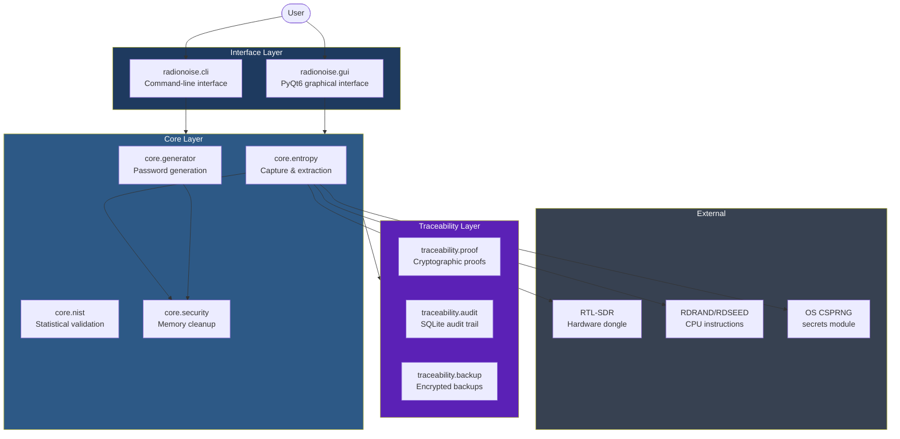
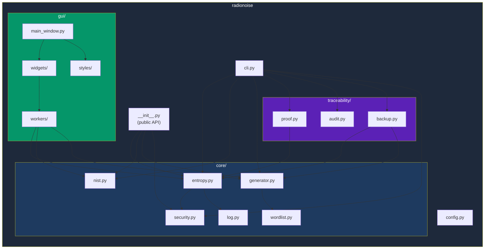
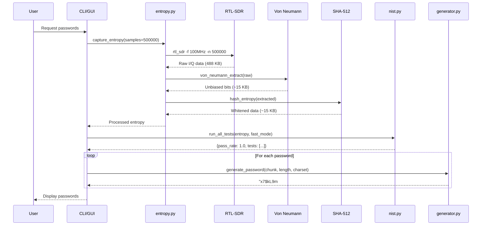
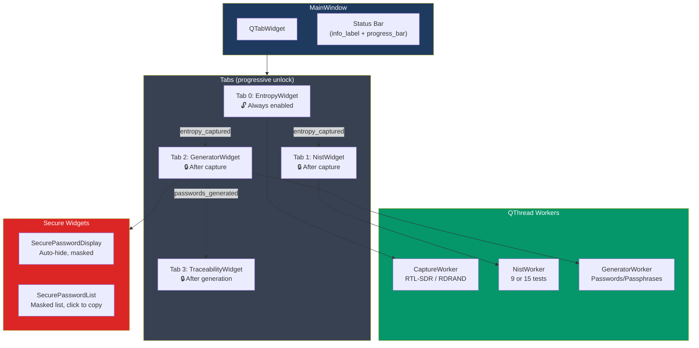

# Architecture

## High-Level Overview



## Module Dependency Graph



## Data Flow: Capture to Password



## GUI Architecture



### GUI Design Principles

- **Progressive disclosure**: Tabs unlock as the workflow progresses (capture → test → generate → trace)
- **Async operations**: All blocking work runs in QThread workers to keep the UI responsive
- **Security by default**: Passwords hidden, clipboard auto-cleared, memory overwritten on close
- **System fonts**: Uses `QFontDatabase.systemFont(FixedFont)` for monospace, system default for UI

### Worker Communication

All workers inherit from `BaseWorker(QThread)`:
- **Cancellation**: `threading.Event` for thread-safe cancel (`self.is_cancelled`)
- **Stdout suppression**: `contextlib.redirect_stdout` prevents sensitive data in console
- **Signals**: Type-safe Qt signals for progress and completion

Widget cleanup is handled by `WorkerWidgetMixin`:
- `_cleanup_worker()`: Disconnects signals, waits for thread, sets worker to None
- Used by all three widget classes

## File Storage

All persistent data is stored in `~/.radionoise/`:

```
~/.radionoise/
├── config.json              # User preferences
├── entropy/                 # Saved entropy files
│   └── entropy_{date}_{time}_{source}.bin
├── proofs/                  # Cryptographic proofs
│   └── proof_{date}_{time}.json
├── backups/                 # Encrypted backups
│   └── {timestamp}/
│       ├── encrypted_iq.bin
│       ├── proof.json
│       └── crypto_metadata.json
└── audit.db                 # SQLite audit trail
```

### Configuration

`config.json` stores user preferences with deep-merge defaults:

```json
{
  "capture": {
    "frequency_mhz": 100.0,
    "samples": 500000,
    "allow_fallback": true,
    "use_rdseed": false,
    "capture_raw": true
  },
  "nist": {
    "fast_mode": true
  },
  "generator": {
    "type": "password",
    "length": 16,
    "count": 5,
    "charset": "safe"
  },
  "gui": {
    "theme": "dark"
  }
}
```

Missing keys are filled from defaults automatically.

## Package Entry Points

| Entry Point | Module | Description |
|-------------|--------|-------------|
| `python RadioNoise.py` | `radionoise.cli:main` | Direct script (compatibility shim) |
| `radionoise` | `radionoise.cli:main` | Installed package command |
| `python radionoise_gui.py` | `radionoise.gui:MainWindow` | GUI launcher |
| `import radionoise` | `radionoise.__init__` | Python library |
