# Entropy Pipeline

RadioNoise extracts cryptographic-quality random data through a multi-stage pipeline that transforms raw physical noise into uniform, validated entropy.

## Pipeline Overview

```mermaid
flowchart LR
    A["📡 RTL-SDR Capture\n500K samples\n~488 KB"] --> B["⚖️ Von Neumann\nExtractor\n~15 KB"]
    B --> C["🔒 SHA-512\nWhitening\n~15 KB"]
    C --> D["📊 NIST SP 800-22\nValidation\n9 or 15 tests"]
    D --> E["🔑 Password\nGeneration\nRejection sampling"]

    style A fill:#2d5986,color:#fff
    style B fill:#8b5cf6,color:#fff
    style C fill:#059669,color:#fff
    style D fill:#d97706,color:#fff
    style E fill:#dc2626,color:#fff
```



Each stage serves a specific purpose:

| Stage | Purpose | Input → Output |
|-------|---------|----------------|
| Capture | Collect raw physical noise | Radio signal → 488 KB raw I/Q |
| Von Neumann | Remove systematic bias | 488 KB → ~15 KB (3.1% efficiency) |
| SHA-512 | Ensure uniform distribution | 15 KB → 15 KB whitened |
| NIST | Statistical validation | 15 KB → pass/fail verdict |
| Generation | Convert entropy to text | Bytes → password/passphrase |

## Entropy Source Fallback Chain

```mermaid
flowchart TD
    Start([Start]) --> RTL{RTL-SDR\navailable?}
    RTL -->|Yes| CaptureRTL["📡 RTL-SDR Capture\n2.4 MS/s @ 100 MHz\n8 bits/byte entropy"]
    RTL -->|No| Fallback{Fallback\nallowed?}
    Fallback -->|No| Error[/"Error:\nNo entropy source"/]
    Fallback -->|Yes| RDSEED{Use\nRDSEED?}
    RDSEED -->|Yes| CaptureRDSEED["🔧 RDSEED\nDirect CPU entropy\nSlow, high quality"]
    RDSEED -->|No| RDRAND{RDRAND\navailable?}
    RDRAND -->|Yes| CaptureRDRAND["🔧 RDRAND\nCPU hardware DRBG\nFast, good quality"]
    RDRAND -->|No| CSPRNG["🔐 System CSPRNG\nsecrets.token_bytes\nOS entropy pool"]

    CaptureRTL --> VN["Von Neumann\n+ SHA-512"]
    CaptureRDRAND --> Direct["Direct use\n(already uniform)"]
    CaptureRDSEED --> Direct
    CSPRNG --> Direct

    style CaptureRTL fill:#2d5986,color:#fff
    style CaptureRDRAND fill:#059669,color:#fff
    style CaptureRDSEED fill:#8b5cf6,color:#fff
    style CSPRNG fill:#d97706,color:#fff
    style Error fill:#dc2626,color:#fff
```



## Stage Details

### 1. RTL-SDR Capture

The RTL-SDR dongle captures raw I/Q (in-phase/quadrature) samples from the radio spectrum.

**Default parameters:**

| Parameter | Value | Rationale |
|-----------|-------|-----------|
| Frequency | 100 MHz (FM band) | High ambient noise floor |
| Sample rate | 2.4 MS/s | Maximum for RTL2832U |
| Gain | 0 (auto) | Let hardware optimize SNR |
| Samples | 500,000 | Yields ~15 KB after extraction |

The raw data contains a mix of:
- **Thermal noise** (Johnson-Nyquist): Random voltage fluctuations from electron thermal motion in conductors
- **Atmospheric noise**: Electromagnetic interference from weather phenomena
- **Galactic noise**: Cosmic background radiation
- **Shot noise**: Discrete charge fluctuations

**Command executed internally:**
```
rtl_sdr -f 100000000 -s 2400000 -g 0 -n 500000 /tmp/capture.bin
```

### 2. Von Neumann Extractor

Raw samples are biased (the RTL-SDR ADC and antenna characteristics introduce systematic biases). The Von Neumann extractor removes this bias.

**Algorithm:**
1. Unpack all bytes into a bit stream
2. Group bits into pairs: (b₀,b₁), (b₂,b₃), ...
3. For each pair:
   - `01` → output `0`
   - `10` → output `1`
   - `00` or `11` → discard
4. Pack extracted bits back into bytes

**Properties:**
- Output is provably unbiased regardless of input bias
- Theoretical efficiency: 25% (if bias = 0.5)
- Practical efficiency: ~3.1% (due to inter-sample correlations)
- Output entropy: 8 bits/byte (maximum)

The implementation uses NumPy vectorized operations for ~5-10x speedup over naive Python.

### 3. SHA-512 Whitening

After Von Neumann extraction, SHA-512 hashing provides a second layer of uniformity:

1. Divide data into 64-byte chunks
2. For each chunk, compute `SHA-512(counter || chunk)`
3. Use the first `len(chunk)` bytes of the hash as output
4. Increment counter for each chunk

The counter prevents identical chunks from producing identical output. This step ensures:
- Uniform distribution even if Von Neumann output has residual patterns
- Forward secrecy (past outputs cannot be derived from current state)
- No information about the original noise leaks through

### 4. NIST SP 800-22 Validation

Before using entropy for generation, RadioNoise runs statistical tests. See [NIST Tests](nist-tests.md) for details.

- **Fast mode** (default): 9 tests, ~1-2 seconds
- **Full mode**: 15 tests, ~30 seconds
- **Threshold**: p-value ≥ 0.01, pass rate ≥ 95%

If tests fail, the user is warned and asked for confirmation before proceeding.

### 5. Password Generation

Validated entropy is converted to passwords using **rejection sampling** to avoid modulo bias:

```
For each byte b from entropy:
    threshold = (256 / charset_size) * charset_size
    if b < threshold:
        character = charset[b % charset_size]
    else:
        discard and try next byte
```

This ensures each character in the charset has exactly equal probability.

For **passphrases**, two bytes are combined into a 16-bit value and rejection-sampled against the EFF wordlist (7776 words):
- Acceptance rate: 7776/65536 ≈ 11.9%
- Average cost: ~17 bytes per word
- Entropy: ~12.925 bits/word

## Scientific Note

The noise captured by the RTL-SDR is predominantly **thermal noise** (Johnson-Nyquist noise), which arises from classical statistical mechanics — the random thermal motion of charge carriers in conductors. This is distinct from quantum randomness (e.g., photon shot noise, radioactive decay).

The unpredictability is **practical** rather than **fundamental**: thermal noise is computationally unpredictable because it depends on the exact microscopic state of ~10²³ particles, but it is in principle deterministic under classical physics.

For cryptographic purposes, this distinction is irrelevant: no adversary can model the thermal state of the antenna and receiver with sufficient precision to predict the output. The entropy extraction pipeline (Von Neumann + SHA-512) further ensures that even partial knowledge of the raw signal does not help predict the output.
