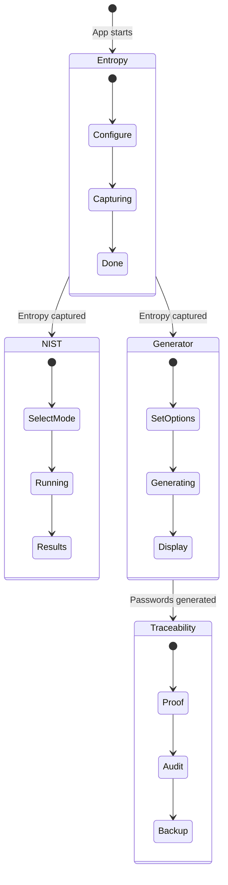
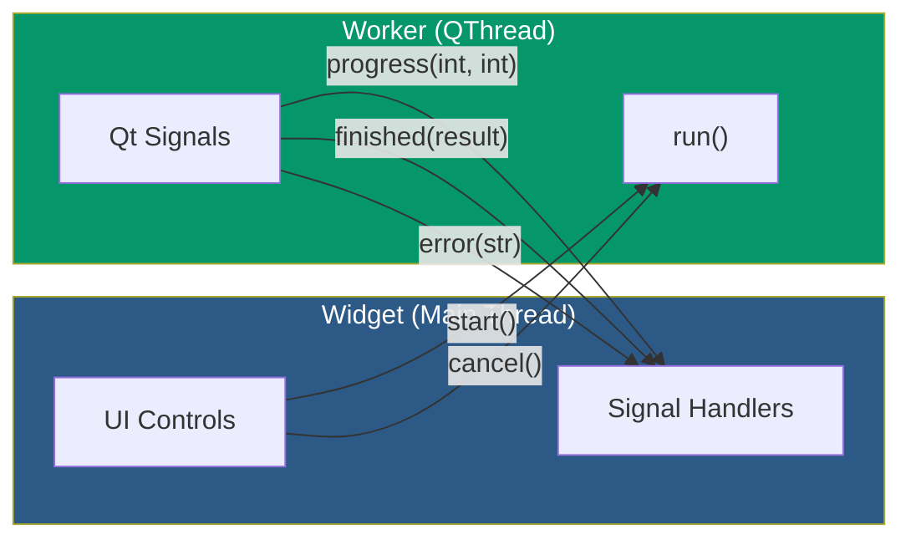

# GUI User Guide

RadioNoise includes a PyQt6 graphical interface for interactive password generation with visual feedback.

## Launching

```bash
python radionoise_gui.py
```

Requires `PyQt6>=6.5.0` (`pip install PyQt6`).

## Tab Workflow

The GUI uses a progressive 4-tab workflow. Tabs unlock as you complete each step:



| Tab | Name | Enabled | Unlocked by |
|-----|------|---------|-------------|
| 0 | Entropie | Always | — |
| 1 | Tests NIST | After capture | Entropy tab: successful capture |
| 2 | Génération | After capture | Entropy tab: successful capture |
| 3 | Traçabilité | After generation | Generator tab: passwords generated |

## Tab 1: Entropie (Entropy Capture)

Configure and capture entropy from available sources.

### Options

- **Fréquence (MHz)**: RTL-SDR capture frequency (default: 100 MHz)
- **Échantillons**: Number of samples (default: 500,000)
- **Permettre le fallback**: Fall back to CPU RNG if RTL-SDR unavailable
- **Utiliser RDSEED**: Use RDSEED instead of RDRAND for CPU fallback
- **Conserver données IQ brutes**: Keep raw I/Q data for traceability (required for proofs and backups)

### Actions

- **Capturer l'entropie**: Start capture (runs in background thread)
- **Annuler**: Cancel an ongoing capture

### Status

After capture, the status bar shows the entropy source used and the amount of data captured.

## Tab 2: Tests NIST (Statistical Validation)

Run NIST SP 800-22 tests on captured entropy.

### Options

- **Mode rapide** (default): 9 essential tests (~1-2 seconds)
- **Mode complet**: All 15 tests (~30 seconds)

These are radio buttons (mutually exclusive).

### Results Table

| Column | Description |
|--------|-------------|
| Test | Test name |
| p-value | Statistical p-value (≥ 0.01 = pass) |
| Résultat | PASS or FAIL |

### Pass Rate

Displayed at the bottom:
- **100%**: Cryptographic quality
- **≥ 95%**: Acceptable
- **< 95%**: Warning (low quality)

## Tab 3: Génération (Password Generation)

Generate passwords or passphrases from validated entropy.

### Options

- **Type**: Password or Passphrase (radio buttons)
- **Longueur**: Length in characters (password) or words (passphrase)
- **Nombre**: How many to generate
- **Jeu de caractères**: Character set (password mode only)
  - `safe`: a-zA-Z0-9 + `-_!@#$%` (default)
  - `alnum`: a-zA-Z0-9
  - `alpha`: a-zA-Z
  - `full`: a-zA-Z0-9 + 25 symbols
  - `hex`: 0-9a-f
  - `digits`: 0-9

### Output

Generated passwords appear in a `SecurePasswordList`:
- Passwords are **masked** by default (shown as `••••••••`)
- **Double-click** to copy a password to clipboard
- Clipboard is **auto-cleared** after 30 seconds
- Entropy per password is displayed

## Tab 4: Traçabilité (Traceability)

Manage cryptographic proofs, audit trail, and encrypted backups.

### Sub-tabs

#### Preuve (Proof)
- **Créer une preuve**: Generate a cryptographic proof linking the capture to the password
- Requires "Conserver données IQ brutes" to be checked in Tab 1
- Saves to `~/.radionoise/proofs/`

#### Audit
- **Ajouter la génération actuelle**: Add the current generation to the audit database
- **Vérifier l'intégrité**: Verify the blockchain chain integrity
- Database at `~/.radionoise/audit.db`

#### Backup
- **Master password**: Enter and confirm (two fields)
- **Créer le backup**: Encrypt and save IQ data + proof
- **Récupérer...**: List and recover from existing backups
- Requires RTL-SDR capture with raw IQ data

## Widget-Worker Communication



- **Start**: Widget creates a worker, connects signals, calls `worker.start()`
- **Progress**: Worker emits `progress(current, total)`, widget updates progress bar
- **Cancel**: Widget calls `worker.cancel()`, which sets a `threading.Event`
- **Finish**: Worker emits result, widget calls `_cleanup_worker()` (from `WorkerWidgetMixin`)
- **Error**: Worker emits error string, widget shows in status bar

## Security Features

### Password Display

- `SecurePasswordDisplay`: Shows a single password, hidden by default
  - Click to reveal for 5 seconds, then auto-hides
  - `secure_clear_widget()` overwrites text with `*` before clearing

- `SecurePasswordList`: Masked list of generated passwords
  - Passwords shown as `••••••••`
  - Double-click to copy to clipboard
  - Clipboard auto-clear after 30 seconds

### Clipboard Security

1. When a password is copied, its SHA-256 hash is stored (not the password)
2. After 30 seconds, the clipboard content is hashed and compared
3. If the hashes match, the clipboard is cleared
4. If the user copied something else, the clipboard is not touched

### Close Confirmation

If a worker is actively running when you close the window:
1. A confirmation dialog appears
2. If confirmed, active workers are cancelled
3. `secure_clear_widget()` is called on all password displays
4. Memory cleanup runs in `closeEvent`

### Font Handling

The GUI never hardcodes font family names:
- **Monospace**: `QFontDatabase.systemFont(FixedFont)`
- **UI text**: `QFont()` (system default sans-serif)
- Point sizes are set separately with `setPointSize()`
