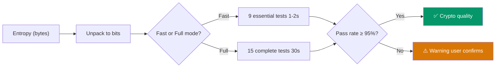

# NIST SP 800-22 Statistical Tests

RadioNoise implements 15 tests from the NIST Special Publication 800-22 ("A Statistical Test Suite for Random and Pseudorandom Number Generators for Cryptographic Applications") to validate entropy quality.

## Test Pipeline



## Test Suite

### Fast Mode (9 tests)

These tests run in ~1-2 seconds and catch the most common entropy defects.

| # | Test | Detects |
|---|------|---------|
| 1 | Frequency (Monobit) | Overall bias toward 0 or 1 |
| 2 | Block Frequency | Local bias within 128-bit blocks |
| 3 | Runs | Too many or too few alternations |
| 4 | Longest Run of Ones | Abnormally long sequences of 1s |
| 5 | Spectral (DFT) | Periodic patterns in the bit stream |
| 6 | Serial | Uneven distribution of 2-bit patterns |
| 7 | Approximate Entropy | Predictability of next bit from pattern context |
| 8 | Cumulative Sums (forward) | Cumulative bias drifting away from zero |
| 9 | Cumulative Sums (backward) | Same test applied in reverse |

### Full Mode (adds 6 more tests)

These tests are computationally expensive but detect subtler defects.

| # | Test | Detects | Notes |
|---|------|---------|-------|
| 10 | Binary Matrix Rank | Linear dependence between bit subsequences | Requires ≥32×32 bit matrices |
| 11 | Non-overlapping Template | Excess occurrences of specific 9-bit patterns | Tests against aperiodic templates |
| 12 | Overlapping Template | Similar to above with overlapping windows | Sliding window approach |
| 13 | Maurer's Universal | Compressibility (low entropy) | Uses L=7, Q=1280 |
| 14 | Linear Complexity | Predictability via LFSR | Uses M=500 block size |
| 15a | Random Excursions | Non-random behavior in cumulative sums | Tests 8 states |
| 15b | Random Excursions Variant | Extended excursion analysis | Tests 18 states |

## Test Details

### Test 1: Frequency (Monobit)

Checks whether the proportion of 0s and 1s is close to 50/50.

- **Statistic**: `S_obs = |sum(2·bit - 1)| / √n`
- **p-value**: `erfc(S_obs / √2)`
- **Fails when**: The bit stream is biased toward 0 or 1

### Test 2: Block Frequency

Divides the sequence into 128-bit blocks and checks each block's proportion.

- **Statistic**: χ² over block proportions
- **Fails when**: Some blocks have significantly more 0s or 1s than expected

### Test 3: Runs

Counts "runs" (consecutive identical bits) and checks against expected values.

- **Fails when**: Too many runs (alternating pattern) or too few (long sequences of same bit)

### Test 4: Longest Run of Ones

Examines the longest run of 1s in fixed-size blocks.

- **Fails when**: The longest runs are abnormally long or short

### Test 5: Spectral (DFT)

Applies a Discrete Fourier Transform to detect periodic components.

- **Fails when**: The spectrum shows peaks indicating periodic patterns

### Test 6: Serial

Counts overlapping m-bit patterns (m=2) and checks for uniform distribution.

- **Fails when**: Some 2-bit patterns appear more often than others

### Test 7: Approximate Entropy

Measures the frequency of overlapping patterns of length m and m+1.

- **Fails when**: The next bit is more predictable than expected from context

### Tests 8-9: Cumulative Sums

Computes a random walk (replace 0→-1, 1→+1) and checks the maximum excursion.

- **Forward**: Left to right
- **Backward**: Right to left
- **Fails when**: The walk drifts too far from zero

### Test 10: Binary Matrix Rank

Constructs 32×32 binary matrices from the bit stream and computes their rank.

- **Fails when**: Matrix ranks show linear dependencies

### Tests 11-12: Template Matching

Searches for occurrences of specific bit patterns.

- **Non-overlapping**: Counts in non-overlapping blocks
- **Overlapping**: Uses a sliding window
- **Fails when**: A pattern appears much more or less than expected

### Test 13: Maurer's Universal

Measures the distances between matching L-bit patterns.

- **Fails when**: Distances are too short (compressible data)

### Test 14: Linear Complexity

Computes the length of the shortest LFSR that can reproduce each block.

- **Fails when**: Complexity is too low (sequence is LFSR-predictable)

### Tests 15a-b: Random Excursions

Analyzes the behavior of the cumulative sum as a random walk, counting visits to specific states.

- **Fails when**: The walk visits certain states more or less than expected

## Interpreting Results

### p-value

Each test produces a **p-value** in [0, 1]:

| p-value | Interpretation |
|---------|----------------|
| ≥ 0.01 | **PASS** — Data is consistent with randomness |
| < 0.01 | **FAIL** — Evidence of non-randomness (99% confidence) |

The threshold of 0.01 means there is a 1% chance of a false failure per test, which is the standard recommended by NIST.

### Pass Rate

RadioNoise requires a **95% pass rate** across all tests:

| Pass Rate | Verdict |
|-----------|---------|
| 100% | Cryptographic quality |
| ≥ 95% | Acceptable (minor weaknesses) |
| < 95% | Low quality — user warned |

A single test failure in fast mode (1/9 = 89%) triggers a warning. In full mode, up to 1 failure (14/15 = 93%) still triggers a warning.

### Data Size Requirements

The tests require minimum amounts of data:

| Test | Minimum bits | Minimum bytes |
|------|-------------|---------------|
| Fast mode | ~10,000 | ~1,250 |
| Full mode (all tests) | ~100,000 | ~12,500 |
| Random Excursions | ~1,000,000 | ~125,000 |

RadioNoise uses 10,000 bytes for fast mode and 100,000 bytes for full mode by default.

## Usage

### CLI

```bash
# Fast mode (default)
python RadioNoise.py -n 5

# Full suite
python RadioNoise.py --full-test -n 5

# Test only (no generation)
python RadioNoise.py --test-only

# Test an existing file
python RadioNoise.py -f entropy.bin --test-only
```

### Python API

```python
from radionoise import NISTTests, capture_entropy

entropy = capture_entropy(samples=500000)

# Fast mode
results = NISTTests.run_all_tests(entropy, verbose=True, fast_mode=True)

# Full mode
results = NISTTests.run_all_tests(entropy, verbose=True, fast_mode=False)

# Inspect results
print(f"Pass rate: {results['pass_rate']:.1%}")
for test in results['tests']:
    print(f"  {test['name']}: p={test['p_value']:.6f} {'PASS' if test['passed'] else 'FAIL'}")
```
