# Traceability

RadioNoise provides three complementary traceability mechanisms to prove when, how, and from what data a password was generated.

## Overview

```mermaid
flowchart TD
    Gen["Password Generation"] --> P["🔏 Proof of Generation\nCryptographic hash chain\nLinks capture → password"]
    Gen --> A["📋 Forensic Audit Trail\nSQLite blockchain\nTimeline of all generations"]
    Gen --> B["💾 Encrypted Backup\nAES-256-GCM\nRecover password from IQ data"]

    P --> Verify["Verify proof\n--verify proof.json"]
    A --> Chain["Verify chain\n--verify-chain audit.db"]
    B --> Recover["Recover password\n--recover backup_id"]

    style P fill:#2d5986,color:#fff
    style A fill:#059669,color:#fff
    style B fill:#8b5cf6,color:#fff
```



| Feature | Purpose | Storage | Requires RTL-SDR |
|---------|---------|---------|------------------|
| Proof of Generation | Prove a password came from specific radio noise | JSON file | Yes |
| Audit Trail | Log all generations with blockchain chaining | SQLite database | No |
| Encrypted Backup | Recover a password from its original IQ data | Encrypted files | Yes |

## Proof of Generation

A cryptographic proof links each step of the pipeline with SHA-256 hashes, creating an unforgeable chain from radio capture to password.

### Hash Chain Construction


### Proof JSON Structure

```json
{
  "timestamp": "2026-02-04T20:18:23.456789Z",
  "capture_hash": "a1b2c3d4...",
  "capture_size": 500000,
  "entropy_hash": "e5f6a7b8...",
  "processed_hash": "c9d0e1f2...",
  "password_hash": "3a4b5c6d...",
  "password_length": 24,
  "charset": "safe",
  "signature": "7e8f9a0b...",
  "metadata": {
    "frequency": 100000000,
    "sample_rate": 2400000,
    "samples": 500000
  }
}
```

The password itself is **never stored** — only its SHA-256 hash. Verification requires the original password.

### API

```python
from radionoise.traceability.proof import ProofOfGeneration

pog = ProofOfGeneration()

# Step 1: Capture with proof
raw_data, proof = pog.capture_with_proof(
    samples=500000,
    frequency=100e6
)

# Step 2: Process with proof
processed, proof = pog.process_with_proof(raw_data, proof)

# Step 3: Generate password with proof
password, proof = pog.generate_password_with_proof(processed, proof,
    length=24, charset="safe")

# Save proof
pog.save_proof(proof, "proof.json")

# Verify proof
valid, message = pog.verify_proof(password, proof)
```

### CLI

```bash
# Generate with proof
python RadioNoise.py --proof --proof-output my_proof.json -n 1 -l 24

# Verify (prompts for password)
python RadioNoise.py --verify my_proof.json
```

## Forensic Audit Trail

The audit trail maintains a blockchain-style SQLite database where each entry is cryptographically linked to the previous one.

### Database Schema


### Blockchain Chaining


If any entry is modified, deleted, or inserted, the chain breaks and `--verify-chain` detects it.

### API

```python
from radionoise.traceability.audit import ForensicAuditTrail

# Create/open audit trail
audit = ForensicAuditTrail("audit.db")

# Add a generation
gen_id, chain_hash = audit.add_generation(proof)

# Log an event
audit.log_event(gen_id, "verify", "Password verified by user")

# Verify chain integrity
valid, errors = audit.verify_chain_integrity()

# Get timeline
timeline = audit.get_timeline(limit=10)

# Get statistics
stats = audit.get_statistics()

# Export report
audit.export_audit_report("report.json")

# Prove generation time (returns proof with chain context)
time_proof = audit.prove_generation_time(gen_id)

audit.close()
```

### CLI

```bash
# Add generation to audit trail
python RadioNoise.py --proof --audit ./audit.db -n 1

# Verify chain integrity
python RadioNoise.py --verify-chain ./audit.db

# Export audit report
python RadioNoise.py --audit-report report.json --audit ./audit.db
```

## Encrypted Backup

Backups store the raw IQ samples encrypted with AES-256-GCM, allowing the original password to be **regenerated** from the physical data. The password itself is never stored.

### Backup/Recovery Process


### Backup Directory Structure

```
backups/{timestamp}/
├── encrypted_iq.bin        # AES-256-GCM encrypted IQ samples
├── proof.json              # Proof of generation (unencrypted)
└── crypto_metadata.json    # Salt, nonce, iterations, charset, length
```

### Crypto Metadata

```json
{
  "salt": "base64-encoded 32 bytes",
  "nonce": "base64-encoded 12 bytes",
  "iterations": 600000,
  "password_length": 24,
  "charset": "safe",
  "capture_size": 500000,
  "timestamp": "2026-02-04T20:18:23Z"
}
```

### API

```python
from radionoise.traceability.backup import SecureBackupSystem

backup = SecureBackupSystem("./backups")

# Create backup
backup_id = backup.backup_password(
    password, proof, raw_iq_data, master_password
)

# List backups
backups = backup.get_backup_list()

# Recover password
password, proof = backup.recover_password(backup_id, master_password)

# Export as portable bundle
backup.export_backup_bundle(backup_id, "bundle.tar.gz")

# Import bundle (with path traversal protection)
backup.import_backup_bundle("bundle.tar.gz")

# Delete backup
backup.delete_backup(backup_id)
```

### CLI

```bash
# Create backup (requires RTL-SDR for raw IQ data)
python RadioNoise.py --proof --backup ./backups --master-password "s3cur3" -n 1

# Using environment variable (recommended)
export RADIONOISE_MASTER_PASS="s3cur3"
python RadioNoise.py --proof --backup ./backups -n 1

# Recover password
python RadioNoise.py --recover "backup_2026-02-04" --backup ./backups

# Interactive master password (no command-line exposure)
python RadioNoise.py --recover "backup_2026-02-04" --backup ./backups
# → prompts for password
```

### Security Notes

- The master password is **not stored** — losing it means losing the backup
- Each backup has a unique salt and nonce
- PBKDF2 uses 600,000 iterations (OWASP 2024 recommendation)
- Bundle import validates all paths against directory traversal and rejects symlinks
- Recovery reprocesses IQ data through the full pipeline (Von Neumann → SHA-512 → generate)
